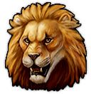
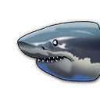

# Colosseum Specialist Pack - Mod
This mod adds Specialist focused on the Colosseum into Anno 117. This Mod is part as a submod of "Extended Specialists Mod".
***
### Item Overview (AI Generated - Might contain Issues. Please point them out if you find some)
***

###  Legendary Specialists

| Image Preview | GUID | Internal Name | Specialist Name | Description | Base Effects | Boost Condition | Boosted Effect |
| :---: | :--- | :--- | :--- | :--- | :--- | :--- | :--- |
|  | 1600000144 | Specialist AE-Collo-Gladiator-L | Victorius Novus, The Roaring Gladiator | "His roar sends shivers down the audience's spines and leaves his opponents frozen in fear. Now he's ready to fight for glory in the arena!" (Colosseum-Pack) | New Areaeffect: • +0.5 Happiness  • +0.5 Money  • +1.5 Prestige  | Requires the presence of a Lion. (Boost Hint: He wants to surpass a real lion with his roar!) | New Areaeffect: • +1 Happiness • +1 Money • +2 Prestige |
|  | 1600000583 | Specialist AE-Collo-Lion-L | Furious Lion | "His claws tear apart every opponent in the arena. May Jupiter have mercy on his victims!" (Colosseum-Pack) | New Areaeffect: • +0.5 Happiness  • +1 Knowledge  • +1 Health | Requires 3x Sheep pastures on Island. (Boost Hint: Helpless sheep are the perfect diet for lions.) |New Areaeffect: • +1 Happiness  • +2 Prestige  • +2 Knowledge |
|  | 1600000590 | Specialist AE-Collo-Bear-L | Wojtecus, Adopted Persian War Bear | "This bear from the lands of the Persians is now here to fight for his place in the arena! And he fights in a surprisingly similar manner to a legionnaire!" (Colosseum-Pack) | New Areaeffect: • +0.5 Happiness  • +1 Prestige  • +0.5 Knowledge  • +0.5 Health | Requires 2x Barracks on Island. (Boost Hint: Often escapes from its enclosure and loves to mingle with the Legionnaires.) | New Areaeffect: • +1 Happiness  • +2 Prestige  • +1 Knowledge  • +1 Health |
|  | 1600000597 | Specialist AE-Collo-Trident-L | Tridentinus, The Glorious Trident | "This retiarius uses Neptune's weapon against his opponents!\r\nWhether he also has Neptune's blessing remains to be seen!" (Colosseum-Pack) | New Areaeffect: • +0.5 Happiness  • +1 Prestige  • +1 FireSafety  • +0.5 Health  | Requires the presence of a Bloodthirsty Shark. (Boost Hint: Wants to battle aquatic creatures.) | New Areaeffect: • +1 Happiness  • +2 Prestige  • +2 FireSafety |
|  | 1600000604 | Specialist AE-Collo-Shark-L | Bloodthirsty Shark | "The monster of the seas! During the Naumachia, this shark is always good for a surprise and leaves nothing but a pool of blood in its wake!" (Colosseum-Pack) | New Areaeffect: • +1 Knowledge  • +0.5 Prestige  • +1 Money  • +1 Health  | Requires 8x Fisheries on Island. (Boost Hint: Fish should keep the shark appeased.) | New Areaeffect: • +2 Prestige  • +2 Money  • +2 Knowledge |
|  | 1600000610 | Specialist AE-Collo-Celt-Gladiator-L | Uernos, The Nordic Hunter | "Look north, where the frost steals one’s breath! Here stands Uernos, whom they call only The Northic Hunter! This Celt knows every creature that roams the deep snow, and has now come here to seek new, bloody adversaries under our sun. Tell me: Do we wish this master of the wilderness well? Or shall this savage perish in the dust of our arena?!" (Colosseum-Pack) |  New Areaeffect: • +0.5 Money  • +1 Prestige  • +1 Health  | Requires the presence of a Persian War Bear. (Boost Hint: Longs to fight a bear from another land.) |  New Areaeffect: • +1 Money  • +2 Prestige  • +2 Health  |

***
